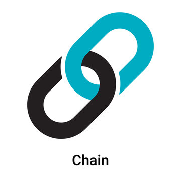

# Project Title: Supply Chain Tracker using BlockChain

### Project Vision
The Supply Chain Tracker is a blockchain-based smart contract designed to streamline and enhance the transparency of product tracking in supply chains. By leveraging the Ethereum blockchain, this contract allows for the creation, transfer, and management of products, ensuring that each product's journey is securely and immutably recorded. This system aims to provide businesses and consumers with a reliable and transparent way to monitor product status, ownership, and location throughout the supply chain.

+---------------------+
|  Create Product     |
+---------------------+
           |
           v
+---------------------+
|  Product Created    |
|  - ID               |
|  - Name             |
|  - Location         |
|  - Owner            |
|  - Status           |
+---------------------+

           |
           v
+---------------------+
|  Transfer Product   |
+---------------------+
           |
           v
+---------------------+
|  Product Transferred|
|  - ID               |
|  - From             |
|  - To               |
|  - New Location     |
|  - New Status       |
+---------------------+

### Contract Details
Contract Name - Supply Chain Tracker
Network - EduChain
Contract Address - '0xcFe86b0E52FaFf1F933bB78da276efED7E4a23B9'

### Key Features
**Product Creation**: Allows users to create new products with details such as name, current location, and status.
**Ownership Transfer**: Enables the transfer of product ownership between addresses, updating the product's location and status in the process.
**Product Details Retrieval**: Provides the ability to view detailed information about a specific product by its ID.
**Owner Product Listing**: Allows users to retrieve a list of product IDs owned by a particular address.
**Event Emission**: Emits events for product creation and transfers, ensuring transparency and traceability of changes.

### Future Scope
- **Enhanced Security**: Implement additional security measures, such as role-based access control and multi-signature requirements.
- **Product History**: Integrate a feature to track the complete history of each product, including all previous owners and locations.
- **Integration with IoT**: Incorporate Internet of Things (IoT) devices to automate and update product status and location in real-time.
- **User Interface**: Develop a user-friendly web or mobile application to interact with the smart contract and visualize product tracking data.

### Contact
For further information or inquiries, please contact:

Name: Tenzin Thabkhe
Email: tenbiz2003@gmail.com
LinkedIn: https://www.linkedin.com/in/tenzin-thabkhe-593138268/
GitHub: https://github.com/tenzinthabkhe
